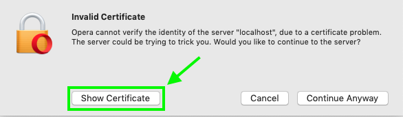
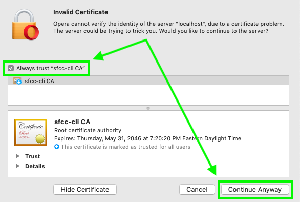

**[↤ Developer Overview](../README.md#developer-overview)**

`sfcc remote`
---

> Connect to SFCC CLI via Browser Extension


Browser Extension Setup
---

To get started, you'll need to [Install the Browser Extension](https://github.com/redvanworkshop/sfcc-remote).

Once you have the browser extension installed, you will need to do the following:

```bash
sfcc remote
```

Once the remote is turned on, all your `sfcc log` and `sfcc watch` output will be pushed to the browser extension.


SSL Certificates
---

**IMPORTANT:** After running `sfcc remote`, check that you can access the following URL in your browser:

```
https://localhost:8443/socket.io/socket.io.js
```

<details><summary>Get Help</summary>

`localhost` certificates are kind of flakey, and you might see something like this, which is normal. Just click through that first time to `Always Trust` the certificate to avoid future headaches.




Once you've confirmed you can access the `socket.io.js` file in your browser, you are good to go.

</details>
